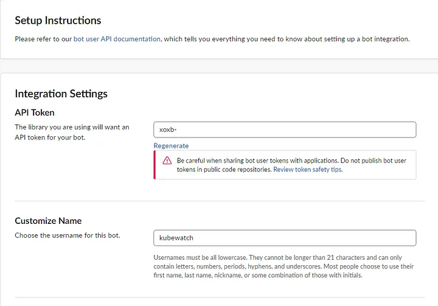
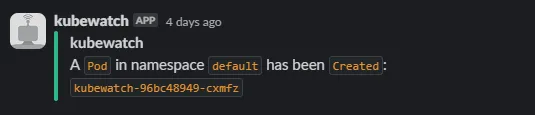
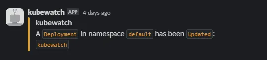
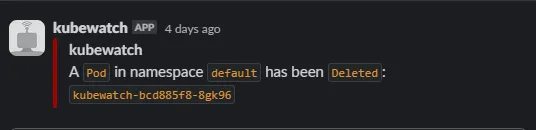

<strong>What is Kubernetes Event Monitoring?</strong>

Kubernetes event monitoring is a monitoring method that allows real-time monitoring of any changes made within the cluster. It helps with monitoring and troubleshooting by providing historical views of changes made. So, what events can we monitor with this method offered to us?

Types of Kubernetes Events:

* <strong>Failed Events:</strong> Indicates an unexpected problem.
* <strong>Evicted Events:</strong> Refers to situations where pods are forcibly removed from a node.
* <strong>Failed Scheduling Events:</strong> Occurs when Kubernetes is unable to schedule a task.
* <strong>Volume Events:</strong> Related to storage issues within Kubernetes.
* <strong>Node Events:</strong> Refers to notifications or alerts related to the nodes.

<strong>What is Kubewatch?</strong>

<a href="https://github.com/robusta-dev/kubewatch">KubeWatch</a> is a popular open source project for tracking changes to Kubernetes clusters. It watches the cluster for resource changes and notifies them through webhooks.

Supported webhooks:

* slack
* slack webhook
* msteams
* hipchat
* mattermost
* flock
* webhook
* cloudevent
* smtp

Based on these informations, I will explain how to use kubewatch with Slack integration simply.

First of all, a slack bot is added to the channel you just created in Slack from the settings integrations section.

* Select Slack Channel for Kubewatch > Browse Apps > Custom Integrations > Bots



After creating the bot, an integration token will be created for us as on the page above. We will use this token in Slack communication with kubewatch.

After these steps, we move on to installing kubewatch . You can install kubewatch with helm or kubectl. I will talk about an example installation with kubectl.

We create a configmap and fill the slack channel name and token information we obtained previously. We need to change the status of the objects under resource that we want to monitor with kubewatch to true.

```yaml
apiVersion: v1
kind: ConfigMap
metadata:
  name: kubewatch
data:
  .kubewatch.yaml: |
    namespace: "*"
    handler:
      slack:
        token: <token>
        channel: <channel>
    resource:
      deployment: false
      replicationcontroller: false
      replicaset: false
      daemonset: false
      statefulset: false
      services: true
      pod: true
      secret: false
      configmap: false
      hpa: false
      coreevent: false
      event: true  
      node: false
```

After that, we need to create a service account, cluster role and connect them with clusterrole binding.

```yaml
kind: ClusterRole
apiVersion: rbac.authorization.k8s.io/v1
metadata:
  name: kubewatch
rules:
- apiGroups: ["*"]
  resources:
  - pods
  - pods/exec
  - replicationcontrollers
  - namespaces
  - deployments
  - deployments/scale
  - services
  - daemonsets
  - secrets
  - replicasets
  - persistentvolumes
  verbs: ["get", "watch", "list"]
---
apiVersion: v1
kind: ServiceAccount
metadata:
  name: kubewatch
  namespace: default
---
apiVersion: rbac.authorization.k8s.io/v1
kind: ClusterRoleBinding
metadata:
  name: kubewatch
roleRef:
  apiGroup: rbac.authorization.k8s.io
  kind: ClusterRole
  name: kubewatch
subjects:
  - kind: ServiceAccount
    name: kubewatch
    namespace: default
```

Finally, we create a deployment.yaml file to deploy the application:

```yaml
apiVersion: apps/v1
kind: Deployment
metadata:
  name: kubewatch
  namespace: default
spec:
  replicas: 1
  selector:
    matchLabels:
      app: kubewatch
  template:
    metadata:
      labels:
        app: kubewatch
    spec:
      serviceAccountName: kubewatch
      containers:
      - image: us-central1-docker.pkg.dev/genuine-flight-317411/devel/kubewatch:v2.5
        imagePullPolicy: Always
        name: kubewatch
        envFrom:
          - configMapRef:
              name: kubewatch
        volumeMounts:
        - name: config-volume
          mountPath: /opt/bitnami/kubewatch/.kubewatch.yaml
          subPath: .kubewatch.yaml
      - image: bitnami/kubectl:1.16.3
        args:
          - proxy
          - "-p"
          - "8080"
        name: proxy
        imagePullPolicy: Always
      restartPolicy: Always
      volumes:
      - name: config-volume
        configMap:
          name: kubewatch
          defaultMode: 0755
```


After a few seconds, when the pods enter the running state, you will be ready to receive event notifications. You can go to your slack channel and check notifications. You will receive notifications of the objects you want to monitor in three different ways, as in the examples below.







Generally, Kubewatch makes it easier for you to follow real-time events in the kubernetes cluster. However, the point that needs to be considered , if you have an unstable environment or large clusters, it may not be easy to manage notifications through a channel.